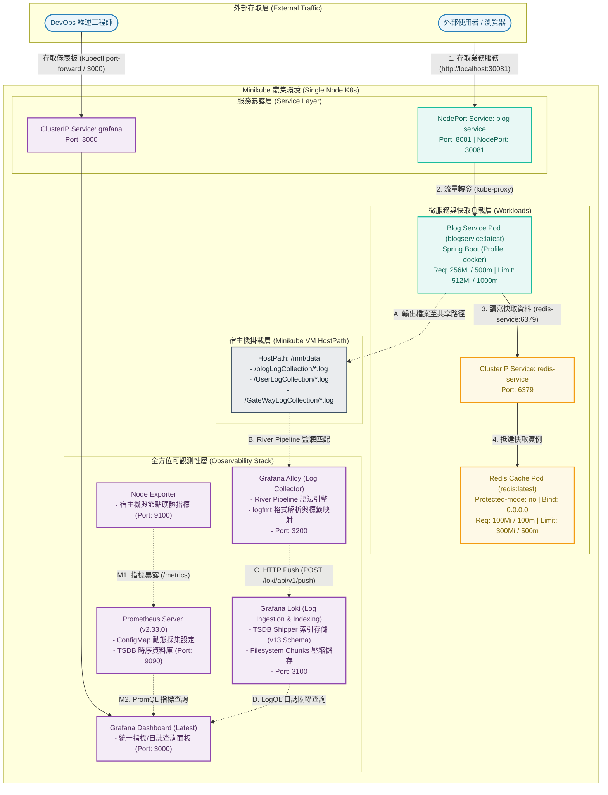

# 單節點 Kubernetes 實作與全棧可觀測性沙盒 (Minikube Full-Stack Sandbox)

[](https://JeffLin0225.github.io/Kubernetes_Minikube/kubernetes.html)

本專案提供基於 **Minikube** 單節點架構的雲原生微服務部署與完整可觀測性（Full-Stack Observability）實踐方案。專案整合了 Spring Boot 業務微服務、Redis 快取層，以及生產級 **Grafana Alloy + Loki + Prometheus + Grafana** 監控日誌採集架構，並包含完整的 Control Plane / Data Plane 內部機制分析與常用維運指令集。

---

## 系統架構

系統劃分為**外部存取層**、**微服務與快取層**、**宿主機日誌掛載**與**全方位可觀測性層**：



---

## 專案結構

```text
.
├── Container/                                  # 容器與叢集維運指令速查庫
│   ├── dockerCommend.txt                       # Docker 系統清理、磁碟釋放與資源檢查指南
│   └── kubeCommend.txt                         # Minikube 生命週期與 kubectl 核心操作指令手冊
├── Deployment/                                 # 業務服務負載配置清單
│   └── blog-deployment.yaml                    # Spring Boot 應用 Deployment 與 NodePort (30081) 定義
├── GrafanaStack/                               # 完整可觀測性堆疊 (Metrics & Logs)
│   ├── alloy-config.yaml                       # Alloy 設定檔掛載預留項目
│   ├── grafana-alloy-deployment.yaml           # Grafana Alloy 日誌採集器與 River Pipeline ConfigMap
│   ├── grafana-deployment.yaml                 # Grafana 視覺化監控面板 Deployment 與 Service (3000)
│   ├── loki-deployment.yaml                    # Grafana Loki 日誌聚合中心（特權/Root 運作模式）
│   ├── loki2-deployment.yaml                   # Grafana Loki 輕量化模式（TSDB 索引 + 記憶體空目錄）
│   ├── node-exporter-deployment.yaml           # Node Exporter 節點指標採集服務 (9100)
│   └── prometheus-deployment.yaml              # Prometheus 時序資料庫與 ConfigMap 採集設定 (9090)
├── Redis/                                      # 快取中介層配置
│   ├── redis-deployment.yaml                   # Redis Deployment 與 ClusterIP 內部網路 Service
│   └── redis.conf                              # Redis 核心配置（綁定 0.0.0.0 與保護模式關閉）
├── kubernetes.html                             # 互動式架構圖（基於 Draw.io 匯出，支援縮放與節點展開）
├── kubernetes.png                              # 靜態架構全貌示意圖
└── Readme.md                                   # 專案架構說明與技術文件
```

---

## 事前準備與環境初始化

### 1. 啟動 Minikube 叢集
```bash
# 啟動 Minikube 單節點環境
minikube start

# 驗證節點狀態
kubectl get nodes
```

### 2. 設置 Docker 環境變數（本地映像共享）
為了讓 Minikube 能直接讀取本機建置的 Docker 映像檔而無需推送到 Docker Hub：
```bash
# 切換當前 Shell 指向 Minikube 內部 Docker Daemon
eval $(minikube -p minikube docker-env)

# 在專案目錄建置業務服務映像檔
docker build -t blogservice:latest .
```

---

## 服務部署流程

### 1. 部署資料庫與快取層
```bash
kubectl apply -f Redis/redis-deployment.yaml
```

### 2. 部署業務微服務
```bash
kubectl apply -f Deployment/blog-deployment.yaml
```

### 3. 部署監控與日誌堆疊 (Grafana Stack)
```bash
# 部署指標採集與 Prometheus
kubectl apply -f GrafanaStack/node-exporter-deployment.yaml
kubectl apply -f GrafanaStack/prometheus-deployment.yaml

# 部署日誌聚合與採集管線 (Loki + Alloy)
kubectl apply -f GrafanaStack/loki-deployment.yaml
kubectl apply -f GrafanaStack/grafana-alloy-deployment.yaml

# 部署 Grafana 儀表板
kubectl apply -f GrafanaStack/grafana-deployment.yaml
```

---

## 服務存取與通訊埠規劃

| 服務名稱 | 類型 (Service Type) | 叢集內部 Port | 對外存取 / NodePort | 說明 |
| :--- | :--- | :--- | :--- | :--- |
| **Blog Service** | `NodePort` | `8081` | `30081` | 業務系統入口，可透過 `http://<minikube-ip>:30081` 存取 |
| **Redis Service** | `ClusterIP` | `6379` | - | 供 Blog Service 內部快取通訊 (`redis-service:6379`) |
| **Grafana** | `ClusterIP` | `3000` | 可 port-forward `3000` | 統一可觀測性儀表板，預設帳密：`admin` / `admin` |
| **Prometheus** | `ClusterIP` | `9090` | 可 port-forward `9090` | 時序指標查詢介面 |
| **Grafana Loki** | `ClusterIP` | `3100` | - | 日誌收集端點 (`http://loki:3100/loki/api/v1/push`) |
| **Grafana Alloy** | `ClusterIP` | `3200` | - | 日誌處理遙測收集器健康檢查介面 |
| **Node Exporter** | `ClusterIP` | `9100` | - | 提供主機硬體等級 Prometheus Metrics |

---

## 可觀測性管線規格

### 1. Grafana Alloy (River 語言日誌採集管線)
Alloy 透過掛載 Minikube 宿主機路徑 `/mnt/data` 監聽多組微服務日誌：
- **匹配路徑**：
  - `/mnt/data/blogLogCollection/*.log` (`service="blog"`)
  - `/mnt/data/UserLogCollection/*.log` (`service="user"`)
  - `/mnt/data/GateWayLogCollection/*.log` (`service="gateway"`)
- **處理階段 (`loki.process`)**：
  - `stage.logfmt`: 動態解析 logfmt 格式日誌中的日誌層級（`level`）。
  - `stage.labels`: 注入 `level` 與 `service` 標籤。
  - `stage.static_labels`: 標記環境別為 `env="development"`。
- **推送輸出**：透過 HTTP Push 協議即時寫入 `http://loki:3100/loki/api/v1/push`。

### 2. Prometheus 指標抓取
- 設定於 `prometheus-config` ConfigMap 中，以靜態目標定期抓取 `node-exporter:9100`。

---

## 常用維運與除錯指令

### Minikube 生命週期管理
```bash
# 開啟 Minikube 視覺化儀表板
minikube dashboard

# 取得 Minikube 虛擬機 IP
minikube ip

# 停止 Minikube
minikube stop

# 完全清除 Minikube（重設環境）
minikube delete --all --purge
```

### 服務除錯與本機端口轉發 (Port-Forwarding)
```bash
# 檢視所有 Pods 與 Services
kubectl get pods -o wide
kubectl get svc

# 本機存取 Grafana
kubectl port-forward svc/grafana 3000:3000

# 本機存取 Prometheus
kubectl port-forward svc/prometheus 9090:9090

# 檢視指定 Pod 日誌
kubectl logs -f <pod-name>
```

### Docker 容器清理與快取回收
```bash
# 檢查 Docker 磁碟空間佔用
docker system df

# 清除未使用的容器、映像與網路緩存
docker system prune -a -f

# 刪除懸空 Volume
docker volume prune -f
```
